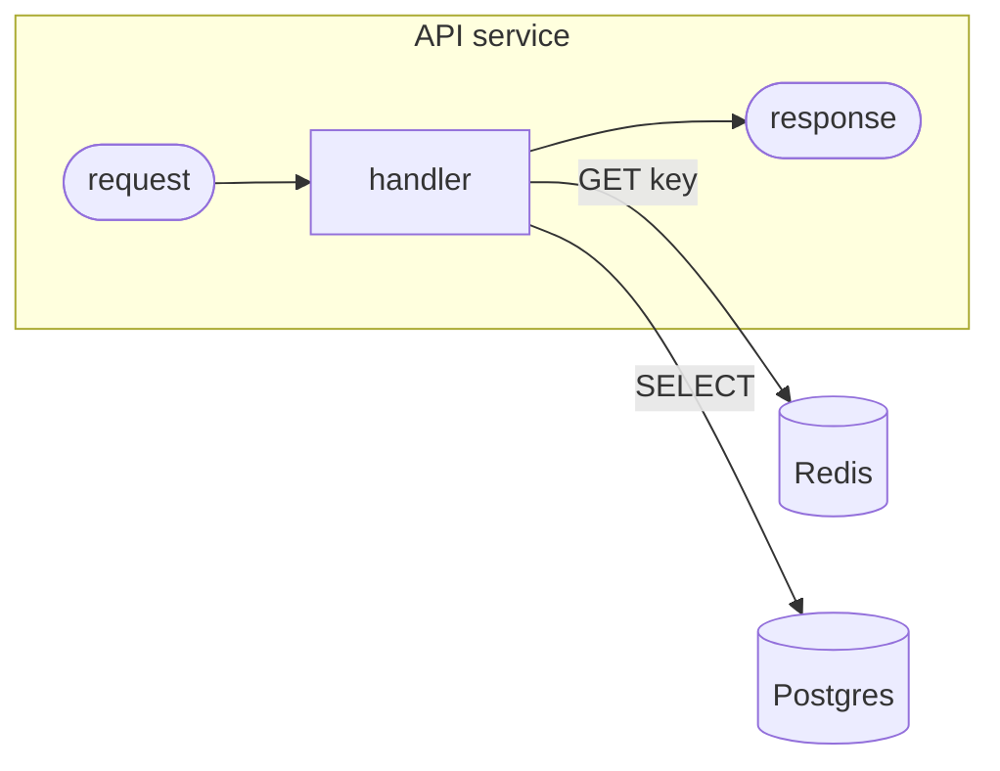
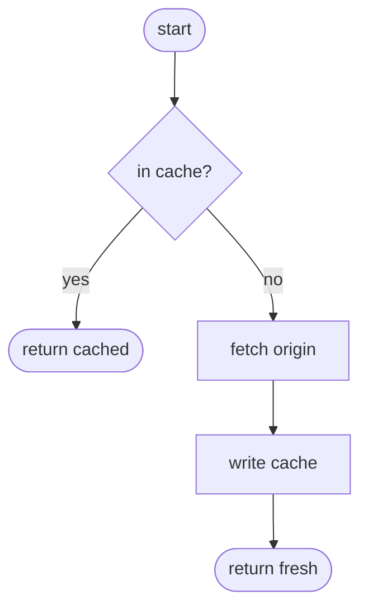
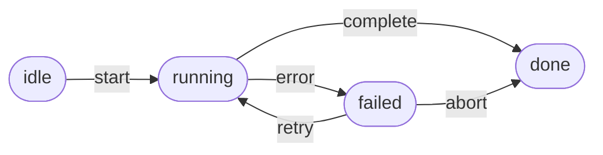
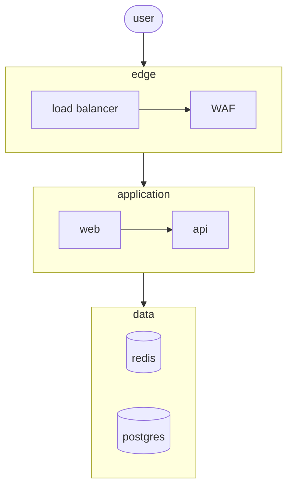
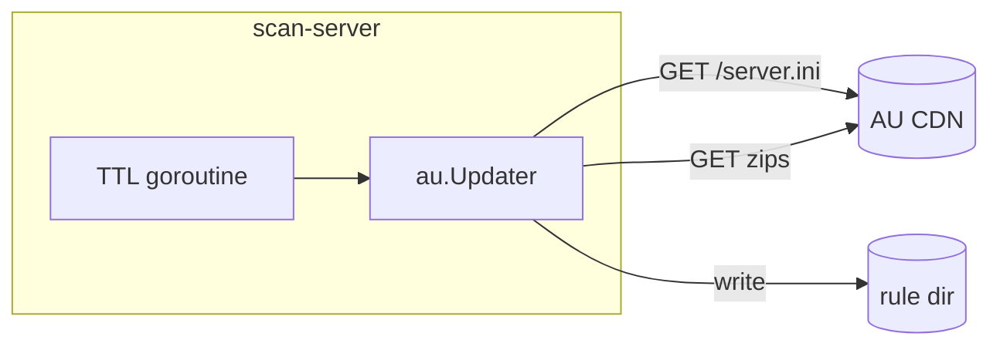
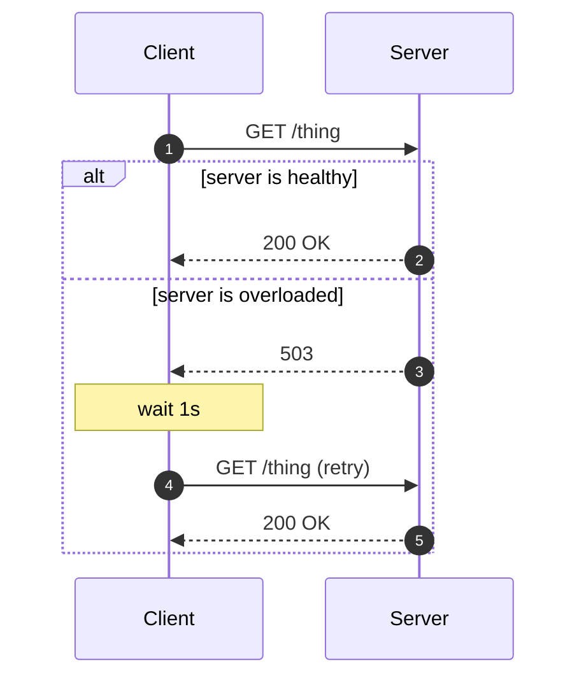
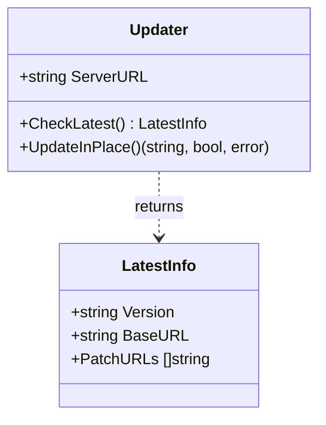

# Excalidraw-Mermaid Drawer

Specialist for producing Mermaid source that survives Excalidraw's
`@excalidraw/mermaid-to-excalidraw` converter without surprises. Default
posture is *be opinionated*: pick the right diagram type for the intent,
use shapes that round-trip well, quote everything that could be ambiguous,
and hand the user something they can paste once and ship.

The two most important rules of this skill:

> **Rule #1 — Visual clarity beats completeness.** A diagram with 8
> uncluttered nodes is worth ten times a diagram with 25 cramped ones.
> If the user has to squint or trace edges with their finger, the
> diagram has failed. Prefer fewer nodes, shorter labels, more
> whitespace, and splitting into multiple diagrams over packing
> everything into one canvas.

> **Rule #2 — Excalidraw supports a subset of Mermaid.** Authoring
> Mermaid that renders in mermaid.live but breaks in Excalidraw is the
> failure mode to avoid. Pick from the supported subset every time.

These two rules win against any other temptation in this document.
When they conflict with anything below, follow them anyway.

---

## Mental model — your Mermaid is a starting point, not the final art

The Excalidraw diagrams that look great — hatched colored fills,
role-coded entity colors, edge annotations in red, callout labels
floating next to boundaries — are **not** one-shot Mermaid output.
They are:

1. A **clean Mermaid** authored with the rules in this skill.
2. Pasted into Excalidraw via "Mermaid to Excalidraw".
3. **Polished by hand inside Excalidraw**: filling subgraph
   backgrounds, recoloring shapes by role, repositioning labels.

Your job in this skill is **step 1**. Optimize the Mermaid so that
step 3 takes one minute, not ten. That means:

- Use subgraphs to mark groups → user fills them with color later.
- Lay out nodes so the user doesn't have to reflow.
- Keep labels short enough that Excalidraw doesn't wrap them mid-word.
- Don't try to encode color or annotations in Mermaid (it'll be stripped).

When the user sees your Mermaid result and asks "how do I make it
pretty?" — that's the expected workflow, not a failure. Walk them
through the polish steps if asked.

---

## Visual clarity rules (these override every other guidance)

These come from the typical Mermaid-to-Excalidraw failure modes —
crossing edges, mid-word wraps, undifferentiated node soup. Follow
all of them.

### 1. Label length: ≤ 20 characters per line, ≤ 2 lines

Excalidraw auto-sizes nodes to fit, but its wrap heuristic is poor.
A 40-character label becomes a node that's either huge or wraps in
the middle of a word.

```
GOOD:  A["CheckLatest"]
       B["parseINI"]
       (two nodes, edge labeled "calls")

BAD:   A["CheckLatest<br/>parseINI<br/>Version = primary.patch"]
       (three lines, will wrap mid-word in many excalidraw versions)
```

When you need to convey multi-step behavior inside one logical
unit, **split into multiple nodes** or move detail to edge labels.

### 2. Never use `<br/>` for line breaks

`<br/>` is in the Mermaid spec but inconsistent in
mermaid-to-excalidraw. Some versions render the literal text
"<br/>" inside the node.

If a label genuinely needs two lines, write it as a single short
phrase and let Excalidraw auto-wrap. If that doesn't work, **split
into multiple nodes** connected by edges. Never bet on `<br/>`.

### 3. Place external systems adjacent to their callers

If `CheckLatest` calls `AU CDN`, put `AU CDN` next to `CheckLatest`
in the source order so the layout engine keeps them close. If
`UpdateInPlace` also calls `AU CDN`, the cleanest structure is one
of:

```
flowchart LR
    %% External on the right, flow on the left
    subgraph Flow["UpdateInPlace"]
        direction TB
        Step1 --> Step2 --> Step3
    end

    AU[("AU CDN")]
    Step1 -. "GET /server.ini" .-> AU
    Step3 -. "GET zips" .-> AU
```

This puts the external system on the right and the flow on the
left — the user can recolor the subgraph and the layout stays
clean.

### 4. Subgraphs are how you tell the user "color this"

A subgraph is a hint to the user: "this whole region is a logical
unit, fill it with a background color in Excalidraw". Always:

- Give the subgraph an explicit ID and quoted label
- Set an explicit `direction TB` or `LR`
- Put only logically-related nodes inside

```
subgraph Server["Scan-Server (Go process)"]
    direction TB
    gRPC["gRPC :50051"]
    HTTP["HTTP :8080"]
    Logic["Business logic"]
    gRPC --> Logic
    HTTP --> Logic
end
```

Don't subgraph for purely visual reasons. Don't nest subgraphs
more than one level deep — excalidraw's layout breaks.

### 5. Minimize edge crossings

Reorder nodes in your source until the most important arrows go in
one consistent direction (top-to-bottom for `TD`, left-to-right
for `LR`). If two edges *must* cross, make one of them dotted
(`-.->`) so the eye separates them.

If a "return to caller" arrow would cross the entire diagram,
*do not draw it*. The implicit return is fine — the next node in
flow tells the reader execution continued.

### 6. One color theme suggestion per diagram

Don't try to convey colors in Mermaid (you can't reliably). But
**leave structural breadcrumbs** that imply where color should go:

- Subgraphs → fill backgrounds
- External systems (cylinder shape `[(...)]`) → distinct color
- Decision diamonds → another color
- Entry/exit (pill shape `([...])`) → another color

The user sees 4 visual categories in the source and applies 4
colors in Excalidraw. That's the unspoken contract.

### 7. Max 12 nodes for "narrative" diagrams, 25 for "reference" diagrams

If you're showing a process flow that the reader will follow with
their eye, 12 nodes is already a lot. If you're showing a
reference (system overview, schema), 25 is the ceiling.

Beyond those numbers, **split into multiple diagrams**:

- One overview ("here are the major components")
- One per zoom-in ("here's what happens inside Component X")

### 8. Whitespace is your friend — leave gaps in source

Mermaid ignores blank lines for layout, but Excalidraw's converter
sometimes uses them as section hints. Even when it doesn't, blank
lines make the *source* readable so you can spot crossings before
you ship.

```
flowchart TD
    Client --> LB
    LB --> Web

    Web --> Cache
    Web --> DB

    Cache -.-> Origin
```

---

## When to invoke

Trigger phrases include:

- "draw this as mermaid" / "make a mermaid diagram"
- "give me a diagram I can paste into excalidraw"
- "flowchart for X" / "sequence diagram of Y" / "architecture diagram"
- "draw the flow" / "diagram this"
- Any time the user asks for a diagram and excalidraw is the rendering target

Also invoke proactively when the user has just described a system or flow
in prose and a visual would obviously help. Confirm the rendering target
(excalidraw vs. mermaid.live vs. github markdown) before producing output
if it isn't already clear — the constraints differ.

---

## Step 0 — Pick the right diagram type

Excalidraw's mermaid integration supports only a handful of diagram
types well. Pick from this list and nothing else:

| Diagram type     | Excalidraw support | When to use                                          |
| ---------------- | ------------------ | ---------------------------------------------------- |
| `flowchart`      | **excellent**      | Default. Process flow, data flow, architecture, decision trees |
| `sequenceDiagram`| **excellent**      | Time-ordered interactions between actors / services  |
| `classDiagram`   | **good**           | OO models, type hierarchies, schema relationships    |

Avoid the rest — they render badly or not at all in Excalidraw at the time of writing:

| Diagram type           | Issue in Excalidraw                                  |
| ---------------------- | ---------------------------------------------------- |
| `stateDiagram-v2`      | Layout breaks; nested states drop                    |
| `erDiagram`            | Crow's-foot notation often missing                   |
| `journey`              | Renders as text only                                 |
| `gantt`                | Frequently fails to convert                          |
| `pie`                  | Loses colors / labels                                |
| `mindmap`              | Layout collapses                                     |
| `gitGraph`             | Inconsistent                                         |
| `requirementDiagram`   | Largely unsupported                                  |
| `C4Context`/`C4Container` | Render as flowchart fallback, often poorly       |

If the user explicitly asks for an unsupported type (e.g. "state machine"),
**translate it into a flowchart** with diamond decision nodes and label
the transitions. State out loud what you did so they know why.

### Decision rules for picking the type

- "Show me how X talks to Y over time" → `sequenceDiagram`
- "Show me what objects/types relate to what" → `classDiagram`
- "Anything else, including 'show me how this works'" → `flowchart`

When in doubt, **default to `flowchart TD`** (top-down). It is the
single most reliable diagram type in Excalidraw.

---

## Step 1 — Flowchart authoring guide

### Direction

```
flowchart TD   # top-down       (default; best for narrative flow)
flowchart LR   # left-to-right  (best for pipelines, wide layouts)
flowchart BT   # bottom-up      (rare)
flowchart RL   # right-to-left  (rare)
```

Prefer **TD** unless the flow is wider than it is tall, then use **LR**.

### Shapes that render reliably

```
id["Rectangle"]                 ← default, use for almost everything
id("Rounded rectangle")         ← softer; good for terminators
id(["Stadium / pill"])          ← entry / exit points
id{"Diamond / decision"}        ← branch points
id(("Circle"))                  ← small marker / status node
id{{"Hexagon"}}                 ← deployment / process boundary
id[("Cylinder")]                ← databases / external storage (may
                                  fall back to rectangle in older
                                  excalidraw — acceptable)
id[/"Parallelogram"/]           ← input/output
id[\"Trapezoid"\]               ← rarely needed
```

Shapes that **do not** render reliably and should be avoided:

```
id[[Subroutine]]                ← collapses to rectangle, looks worse
id>flag]                        ← rendering is glitchy
id{{"Hexagon with brackets"}}   ← OK in mermaid.live, mixed in excalidraw
```

### Edges

```
A --> B                         ← solid arrow (most common)
A --- B                         ← solid line, no arrow
A -.-> B                        ← dotted arrow
A ==> B                         ← thick arrow
A <--> B                        ← bidirectional (excalidraw renders both heads)
```

Edge labels:

```
A -- text --> B                 ← short label, no spaces
A -- "label with spaces" --> B  ← always quote when there's a space
A -. "dotted with text" .-> B   ← dotted with label
```

### Choosing labels for edges

Decision branches should be labeled `yes` / `no` (not `true` / `false`).
HTTP calls should be labeled with the method and path: `"GET /server.ini"`.
Data flow should name the payload: `"INI body"`, `"JWT"`, `"event"`.

---

## Step 2 — Hard rules (these prevent the most common rendering issues)

1. **Always quote labels that contain anything other than letters,
   digits, and underscores.** Especially parentheses, hyphens, slashes,
   colons, dots, commas, equals signs. When in doubt, quote.

   ```
   GOOD: A["GET /server.ini (HTTP 200)"]
   BAD:  A[GET /server.ini (HTTP 200)]          ← parser will choke on the parens
   ```

2. **Never use `<br/>` for line breaks.** See the Visual clarity
   rules above — it's inconsistent across excalidraw versions and
   often renders as literal text. If you need multi-line content,
   **split into separate nodes** instead.

   ```
   GOOD: A["CheckLatest"] --> B["parseINI"]
   BAD:  A["CheckLatest<br/>parseINI"]
   ```

3. **Avoid HTML entities.** `&lt;`, `&gt;`, `&amp;`, `&quot;` render as
   the entity text in some excalidraw versions. Use the actual character
   wrapped in quotes:

   ```
   GOOD: A["mkdtemp(<ruleDir>/.au-tmp-*)"]
   BAD:  A["mkdtemp(&lt;ruleDir&gt;/.au-tmp-*)"]
   ```

   The exception: if quotes are themselves the problem (e.g. you need a
   literal `"`), use `#quot;` (Mermaid's own escape) rather than `&quot;`.

4. **Never use a unicode arrow inside a label.** `→` and `←` will work
   in mermaid.live but break parsing in some excalidraw versions. Use
   the words `into`, `to`, or use an actual edge in the graph.

   ```
   GOOD: rename["rename tmpDir/* into ruleDir/*"]
   BAD:  rename["rename tmpDir/* → ruleDir/*"]
   ```

5. **Keep node IDs short and ASCII.** `A`, `B`, `Step1`, `CheckLatest`.
   Don't use spaces, hyphens, dots, or unicode in IDs. The label is where
   the prose lives.

6. **Don't put markdown inside labels.** `**bold**`, `*italic*`,
   backticks — all render literally.

7. **Subgraphs work but are layout-fragile.** Use them only when you
   need to visually group nodes (a service boundary, a process boundary).
   Always give subgraphs both an ID and a quoted label:

   ```
   subgraph App["Application Tier"]
       direction TB
       A --> B
   end
   ```

   Inside a subgraph, declare an explicit `direction` if the global one
   doesn't suit. Excalidraw respects the inner direction.

8. **Limit nodes to roughly 30.** Excalidraw mermaid integration handles
   small-to-medium diagrams well; large graphs lose their layout and
   become unreadable. Split into multiple diagrams instead.

9. **No `click` handlers, no styling inside the diagram.** `classDef`,
   `style`, `linkStyle`, `click` all get stripped or ignored by
   excalidraw. If color/style matters, ask the user to apply it in
   excalidraw after pasting.

---

## Step 3 — Sequence diagram authoring guide

Use `sequenceDiagram` when the user wants to show a time-ordered
interaction between named participants.

```
sequenceDiagram
    autonumber
    participant C as Client
    participant S as Server
    participant DB as Database

    C->>S: POST /login {user, pass}
    S->>DB: SELECT user WHERE email=?
    DB-->>S: row
    S-->>C: 200 OK + JWT

    Note over C,S: Subsequent requests carry the JWT
    loop every 5 minutes
        C->>S: GET /heartbeat
        S-->>C: 200
    end
```

### Sequence diagram rules

- **`autonumber`** is almost always a win — it adds step numbers, which
  helps reviewers refer to specific calls.
- **Use `participant` declarations even for one-character actors.**
  This lets you give a friendly display name without polluting the
  message lines.
- **Arrow types**:
  - `->>` solid arrow (synchronous call, request)
  - `-->>` dotted arrow (return value, response)
  - `-x`  solid arrow with X (failed call)
  - `--x` dotted arrow with X (failed return)
- **`Note over X,Y: ...`** is your most powerful annotation tool. Use it
  to explain non-obvious state changes.
- **`loop`, `alt`, `opt`, `par`** all render in excalidraw — but keep
  nesting shallow (≤ 2 levels).
- **Activations (`+` / `-`)** sometimes don't render in excalidraw. Omit
  them unless you specifically need them.

### When sequence beats flowchart

- Two or more parties exchanging messages → sequence.
- A pipeline through stages with no back-talk → flowchart LR.
- A decision tree → flowchart TD.

---

## Step 4 — Class diagram authoring guide

Use `classDiagram` for type hierarchies, schema relationships, or
domain models.

```
classDiagram
    class Updater {
        +string ServerURL
        +HTTPClient *http.Client
        +string UserAgent
        +New(serverURL string) Updater
        +CheckLatest(ctx) LatestInfo
        +UpdateInPlace(ctx, ruleDir, currentVersion) (string, bool, error)
    }

    class LatestInfo {
        +string Version
        +string BaseURL
        +PatchURLs []string
    }

    Updater ..> LatestInfo : returns
```

### Class diagram rules

- **Relationship arrows**:
  - `<|--` inheritance (extends)
  - `*--` composition
  - `o--` aggregation
  - `-->` association
  - `..>` dependency (dotted)
  - `..|>` interface realization
- **Always label arrows** with the relationship name when ambiguous.
- **Stereotypes** like `<<interface>>` work but render literally. Don't
  overuse — most readers know what `Repository` is.
- **Visibility marks** (`+`, `-`, `#`, `~`) render fine.
- **Avoid generics in method signatures** with `<T>` — same issue as the
  unicode arrow rule. Use the language's type if possible (e.g. Go
  generics: `[T any]` works because no angle brackets).

---

## Step 5 — Pre-output validation checklist

Before handing the diagram to the user, run through every item:

- [ ] Diagram type is one of `flowchart`, `sequenceDiagram`, `classDiagram`.
- [ ] If flowchart: direction is set (`TD` / `LR`).
- [ ] Every label with a space, paren, hyphen, slash, colon, or dot is quoted.
- [ ] No HTML entities (`&lt;`, `&gt;`, `&amp;`, `&quot;`) in labels.
- [ ] No unicode arrows (`→`, `←`, `⇒`) in labels — written as `into` or routed via edges instead.
- [ ] **No `<br/>` anywhere** — multi-line content is split into multiple nodes.
- [ ] Every label is ≤ 20 characters per line, ≤ 2 lines.
- [ ] No `**bold**` / `*italic*` / backticks in labels.
- [ ] Node IDs are short, ASCII, and don't contain hyphens or dots.
- [ ] **Total node count ≤ 12 for narrative diagrams, ≤ 25 for reference.**
- [ ] No `classDef`, `style`, `linkStyle`, or `click` directives.
- [ ] If subgraphs used: each has an `id["label"]`, an explicit `direction`, and nesting depth ≤ 1.
- [ ] **External systems (CDN, DB, third-party API) are placed adjacent to their callers in source order.**
- [ ] No edges cross the diagram diagonally — if any do, reorder source until they don't.
- [ ] If "return to caller" or "loop back" would draw a long arrow, omit it — implicit return is fine.

If any item fails, **fix the source before output, don't deliver and warn.**

---

## Step 6 — Output format

Hand the user the Mermaid source inside a fenced code block tagged
`mermaid`. Below it, give **two short blocks**:

**Block 1 — Paste & insert** (one sentence):

> Open Excalidraw → press `Ctrl/Cmd + Shift + M` → paste → Insert.

**Block 2 — Polish suggestions** (a 3-5 line bulleted list, no
filler). Tell the user *exactly* what to recolor / fill in
Excalidraw to make it look intentional:

- "Fill subgraph `Server` with a soft pink background (hatched
  works well in the Excalidraw default style)."
- "Recolor the cylinder `AU CDN` to a distinct color (e.g. light
  yellow) so it visually reads as an external system."
- "Make the decision diamond `VersionCheck` a different fill so
  it stands out from process boxes."
- "Add a small floating text label `FFI boundary` near the edge
  between `cgo Bridge` and `C shim` if you want to call out the
  language boundary."

Do **not** include the source twice. Do **not** wrap it in extra
headings. Do **not** mock up a preview — Excalidraw is the preview.

If the user comes back saying "it doesn't look like the example I
showed you", the issue is almost always **polish, not Mermaid**:
walk them through filling subgraph backgrounds and recoloring by
role.

If the user asks for multiple variants ("vertical vs horizontal",
"with vs without subgraph"), present them as separate code blocks
each with a one-line description.

---

## Patterns / recipes

All recipes here follow the short-label, external-adjacent,
subgraph-for-grouping rules. Each is designed to look clean
*before* the user polishes, and polish-friendly *after*.

### Recipe: API call with external storage (the "happy path" diagram)



Why this works: external systems are on the right, the request
flow is a tight vertical column on the left, only 5 nodes plus 2
externals, and the subgraph gives the user one fill target.

### Recipe: Process with decision branch (the "early return" diagram)



Why this works: 6 nodes, all labels ≤ 14 chars, edges all go down
or right, the `yes` branch terminates immediately so it doesn't
loop back across the diagram.

### Recipe: State machine (since stateDiagram isn't supported, draw as flowchart LR)



Why this works: all node IDs are 3-4 chars, all transition labels
are single verbs, `LR` direction matches the linear "progress"
metaphor.

### Recipe: Layered system architecture (the "what's where" diagram)



Why this works: each tier is its own subgraph (three fill
targets for the user), arrows between tiers use the subgraph name
not individual nodes (cleaner), and `LR` inside each subgraph
keeps tiers as horizontal rows.

### Recipe: External-system-heavy diagram (the "what calls what" diagram)

When a process talks to several external systems, **put the
process in one subgraph and the externals next to it as separate
top-level nodes**. Don't put externals inside the subgraph or
they'll inherit its color and stop reading as external.



Why this works: external systems are visually separated from the
process, multiple calls to the same external collapse into
clearly-labeled edges, and the subgraph implies "color me as a
unit".

### Recipe: Sequence with retry



### Recipe: Class diagram with one relationship



---

## Common gotchas

| Symptom in Excalidraw                            | Likely cause                                | Fix                                       |
| ------------------------------------------------ | ------------------------------------------- | ----------------------------------------- |
| "Failed to parse mermaid"                        | Unquoted special characters in a label      | Wrap label in `"..."`                     |
| Node label shows literal `&lt;`                  | HTML entity used                            | Replace with the actual character (`<`)   |
| Arrow text shows `→` literally as a glyph        | Unicode arrow inside a node label           | Use word `into` / `to`, or route via edge |
| Cylinder renders as rectangle                    | Older excalidraw / mermaid-to-excalidraw    | Acceptable — or switch to `[id]`          |
| Two arrows between same nodes overlap            | `A <--> B` collapsed                        | Split into `A --> B` and `B --> A`        |
| Subgraph contents arranged unexpectedly          | No explicit `direction`                     | Add `direction TB` / `direction LR`       |
| Labels with `(...)` break parsing                | Mermaid eats the parens as syntax           | Quote the label                           |
| Sequence diagram numbers missing                 | Forgot `autonumber`                         | Add `autonumber` after `sequenceDiagram`  |
| Class diagram methods render on one line        | Excalidraw collapses whitespace             | One method per line, in source            |
| Diagram is too dense to read                     | > 30 nodes / deep nesting                   | Split into 2+ diagrams                    |

---

## Failure-mode catalog (recognize these in user feedback)

When the user says "the diagram looks bad", match the symptom
against this list before changing anything else:

### Symptom: text wraps mid-word inside a node

Example: a node labeled `tmpDir = mkdtemp(<ruleDir>/.au-tmp-*)`
becomes a box with `.au-tmp-` on one line and `*)` on the next.

**Cause**: label too long, Excalidraw auto-sized the node and
wrapped at the closest space.

**Fix**: shorten the label (≤ 20 chars) or split into two nodes:
one for the operation (`mkdtemp`), one for the result
(`tmpDir = ruleDir/.au-tmp-X`). The split is almost always better
because it also makes the diagram easier to annotate.

### Symptom: `<br>` or `<br/>` appears as literal text inside nodes

**Cause**: this Excalidraw version doesn't process the HTML
line-break tag.

**Fix**: split into multiple nodes. Never rely on `<br/>` again.

### Symptom: edges cross the entire diagram diagonally

Example: a `loop back from CDN to CheckLatest` arrow swings from
the bottom-right of the canvas to the top-left.

**Cause**: external system placed far from its caller in source
order. Mermaid's layout engine tries to honor source order, so
the edge has to traverse the whole canvas.

**Fix**: reorder source so the external is declared immediately
after the node that calls it. If multiple nodes call the same
external, place the external between them or use the
"externals-on-the-right" pattern from the recipes.

### Symptom: external system (CDN, DB) renders as a tiny node lost in the diagram

**Cause**: declared with default rectangle shape, no visual
distinction.

**Fix**: use the cylinder shape `[("name")]`. Even if Excalidraw
falls back to a rectangle, the user can hand-recolor it. Also
shorten its label — `"AU CDN"` reads cleaner than
`"ActiveUpdate CDN (Akamai)"`.

### Symptom: diagram has no visual hierarchy — everything looks the same

**Cause**: no subgraphs, no shape variety, every node is a default
rectangle.

**Fix**: introduce one subgraph per logical region, use the
cylinder shape for storage/external, use the diamond for
decisions, and use the pill shape `([...])` for entry/exit.
Four visual categories is plenty.

### Symptom: text overlaps shape borders / callouts

**Cause**: usually a polish issue in Excalidraw, not a Mermaid
issue. Long edge labels or floating annotations get placed on top
of nearby nodes.

**Fix**: in the Mermaid, keep edge labels short (3-5 words). For
annotations that are too long for edges, **omit them from
Mermaid** and tell the user to add them as floating text in
Excalidraw after pasting.

---

## When the user reports it didn't render

Walk through, in order:

1. **Which excalidraw**: the web app (excalidraw.com), the desktop app,
   the VS Code extension, or excalidraw embedded in Obsidian / Notion?
   Each ships a different mermaid-to-excalidraw version.
2. **Copy-paste fidelity**: did smart quotes get substituted? Did
   newlines get stripped? Ask them to paste raw.
3. **Specific render issue**: get a screenshot or description. Match
   against the gotchas table.
4. **Last-resort fix**: simplify aggressively. Remove subgraphs, replace
   all non-rectangle shapes with rectangles, replace all bidirectional
   edges with two directed edges, strip every edge label down to the
   essentials. Most "won't render" issues come from one specific
   feature — strip until it works, then add back.

---

## Anti-patterns

- **Don't** produce a Mermaid diagram that's syntactically valid in
  mermaid.live but uses features the excalidraw converter doesn't
  understand. The whole point of this skill is the excalidraw target.
- **Don't** dump a 50-node mega-diagram. Excalidraw will technically
  render it but the user can't read it. Suggest a split.
- **Don't** explain Mermaid syntax to the user unless they ask. They
  want the diagram, not a tutorial.
- **Don't** invent shapes or arrow styles. Stick to the documented set
  in this skill — they are the ones known to round-trip.
- **Don't** include `%%{init:...}%%` directives. Excalidraw ignores
  them; they look like noise.
- **Don't** use the long arrow syntax `--->` (3 dashes). Excalidraw
  handles `-->` consistently; `--->` parses but renders inconsistently.

---

## One-line summary

> Pick `flowchart TD`, quote every label, **no `<br/>`**, ASCII-only IDs,
> **≤ 20 chars per label, ≤ 12 nodes for narrative diagrams**, external
> systems adjacent to callers, subgraphs to mark "fill this region with
> color". Hand the user one fenced `mermaid` block, one sentence on
> paste, and three polish suggestions for inside Excalidraw.
